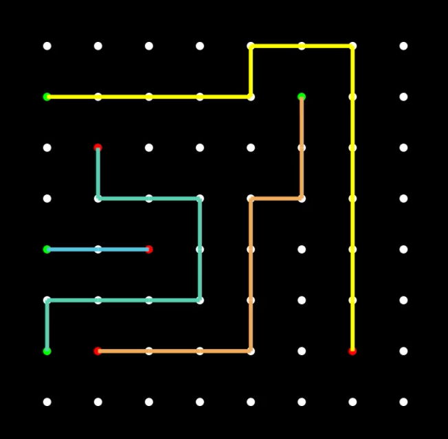
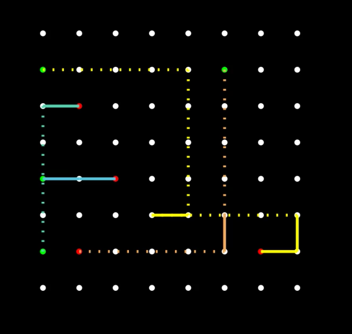
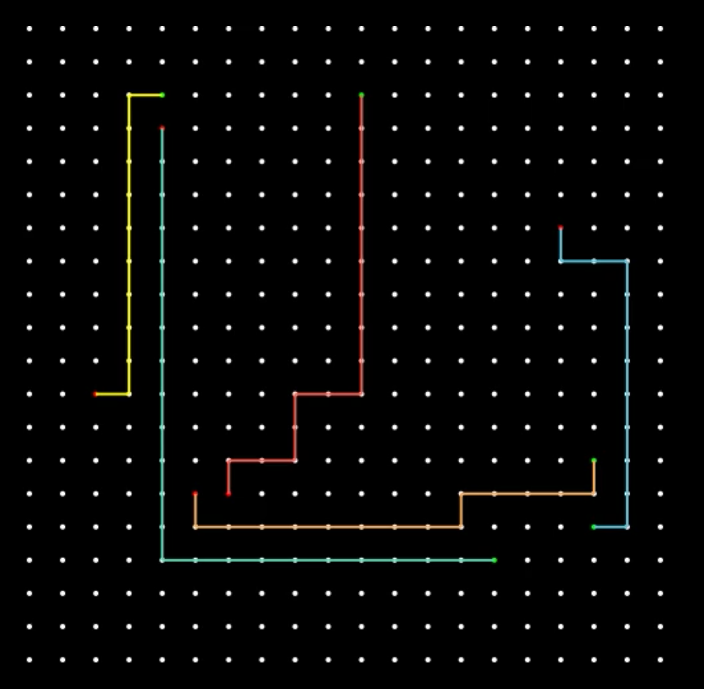
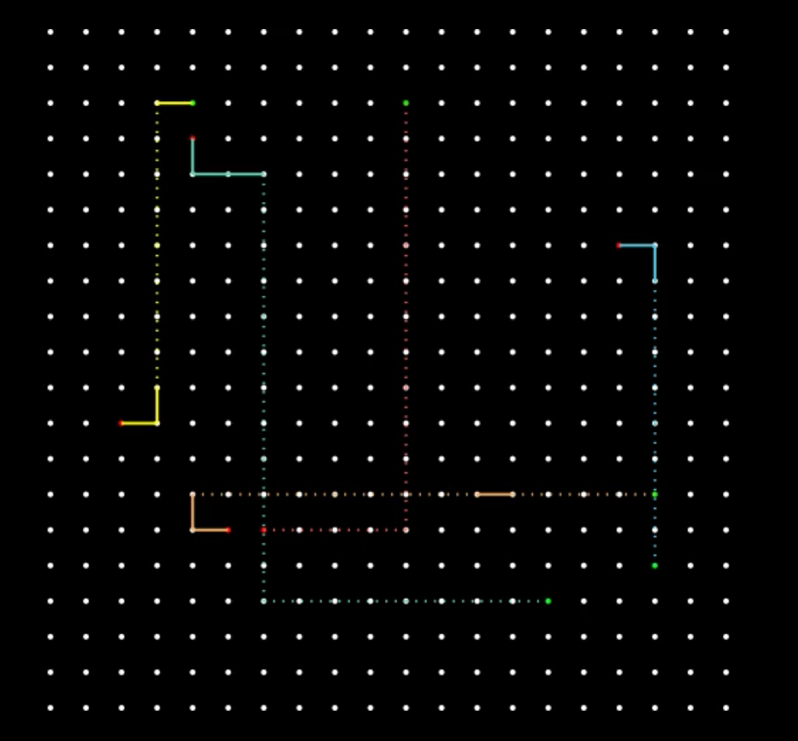

# Procedural generation of supply chain networks using a constraint based multiagent path-finding algorithm

Or in a less buzzword sentence

> Generating a road network connecting supply and request nodes for factory like games.

Work is based on the paper: **Suboptimal Variants of the Conflict-Based Search Algorithm for the Multi-Agent Pathfinding
Problem** by Max Barer, Guni Sharon, Roni Stern and Ariel Felner [1]

## Introduction

The research is done with Factorio in mind as I don't have much experience in other factory games. The concepts however
should be applicable to similar games as well.

The idea for the research started with the global concept of generating a complete factory with procedural generation
for a game like Factorio. An overview of the involved steps and concepts showed quickly that the scope had to be
narrowed down.

The scope narrowed to the generation of paths ('belts' in Factorio) given a set of start and end locations for each path.
The algorithm for this is based on the paper linked above[1].

## First PoC

A basic implementation is done using the CBS algorithm. It can generate paths for multiple agents on a simple grid with
a simple move type. I have a relatively simple animation for this. Using the [manim math animation library][manim] I
created some simple animations of the current work.

# Examples

Below are some images of the current implementation

Every white dot is a location in the grid and a place where a road piece could be placed. Every line is a unique path.

Paths cannot overlap except for the dotted lines which are tunnels. A tunnel is 4 long and can be crossed over by
another path in the middle. A solid or dotted path can cross a dotted path in the middle.

In the small (8x8) setup with tunnels you can see the problem occurring with the overlap when placing a tunnel: the
yellow path goes to the left before creating a tunnel to the right overlapping with itself. This is a problem needing
more research.

|           |                     Basic                     |                  With tunnels                   |
|-----------|:---------------------------------------------:|:-----------------------------------------------:|
| **Small** |  |  |
| **Big**   |    |    |

## Possible extra research topics / iterations

- Implement _Greedy-CBS_, _Bounded-CBS with focal search_ or _Enhanced-CBS_ as described in the paper linked above. They
  respectively have better performance/results but also increasing complexity to implement.
- Add extra 'road'-types. Factorio has the concept of for example
    - **tunnels**: These are essential to have dozens of paths in a limited space. I already tried adding this (see
      attached pictures) but ran into a problem in the low-level A* algorithm used to generate paths. The tunnels change
      the assumption that the lowest cost+path to get to a node is also the best path for the solution. It does not have
      to be the best path leading to the destination as the choice of a tunnel having a good local score can have a big
      cost increase later. This is because the tunnel is 4 steps long, blocking position 1 and 3 and allowing another
      path to pass over position 2. The blocked positions mean that this choice blocks future choices. I think I could
      implement this by using a tree of paths and selecting leaf nodes using a heuristic instead of keeping 1 cost and
      ancestor per node, but I could be going in the wrong direction here. I did not yet find any good literature on
      this.
    - **splitters**: Now one agent in my algorithm creates one path. Most of the time in Factorio you want a start point
      to connect to multiple end points. This can be done by splitting a path into 2 using a special piece. I'm not sure
      yet how I would solve this in terms of the agent count. I think I could combine agents of the same type to walk
      together maybe.
- Add an agent type. Agents with the same type could have a path on the same locations (although reducing throughput of
  that path/belt). This adds the complexity of having to group agents together and having to split them off again. This
  would require the implementation of the above-mentioned splitters.
- Implement the algorithm in a Factorio mod to be more visual and practically usable. This means rewriting the code in
  Lua (it's now in python) and hooking it into a Factorio environment.
- Implement the algorithm in a dynamic environment (game-engine for ex.) where you can change the grid, and it's agent
  and have instant recalculations.
- Implement the algorithm in a more performant environment like C++.

## Tunnels

I did some work on support tunnel types which resulted in the realisation that the A* algorithm is unfit on the lower
level to find these paths. A* is performant due to the fact that

1. subsequent loops reuse the previous calculations to generate a very limited amount of possibilities
2. nodes don't have to be revisited when you have a continuesly increasing or decreasing heuristic function.

Our new problem set breaks both these promises. Research needs to be done to work this out.

TODO Work in progress

[1]: https://www.aaai.org/ocs/index.php/SOCS/SOCS14/paper/viewFile/8911/8875

[manim]: https://www.manim.community/
